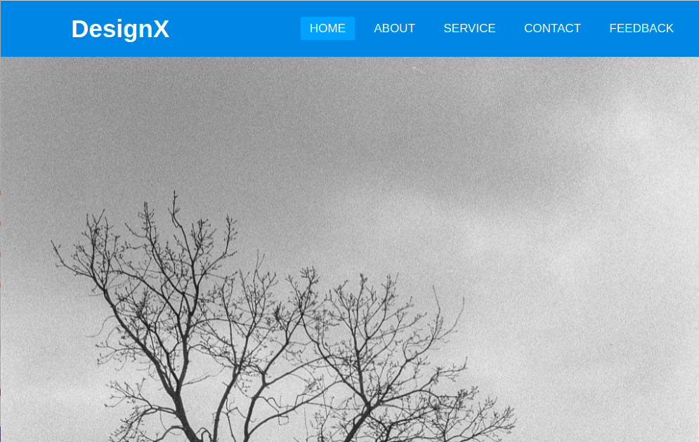
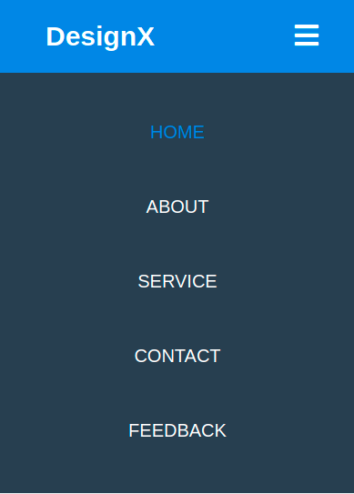

# Responsive Navbar

### Screenshot
#### Desktop

#### mobile



## Table of contents

- [Overview](#overview)
  - [Screenshot](#screenshot)
  - [Links](#links)
- [My process](#my-process)
  - [Built with](#built-with)
  - [What I learned](#what-i-learned)
  - [Useful resources](#useful-resources)
- [Author](#author)


## Overview


### Links

- Solution URL: [Github](https://github.com/ahmedmohamedeid98/responsive-navbar-html.git)
- Live Site URL: [https://ahmedmohamedeid98.github.io/responsive-navbar-html/](https://ahmedmohamedeid98.github.io/responsive-navbar-html/)

## My process

### Built with

- HTML5
- CSS

**Note: These are just examples. Delete this note and replace the list above with your own choices**

### What I learned

In this project i learned that i can do responsive without bootstrap just using css

```css
@media(max-width: 958px) {
  /*what changes to ui components should happen when screen width be less than or equal this width*/
}
@media(max-width: 850px) {
  /*what should happen in this width...*/
}
```
set background image

```css
.container {
  background: url(path...) no-repeat;
  background-size: cover;
  /*fill viewport height minus navbar height*/
  height: clac(100vh - 80px); 
  /*The CSS calc function is used to perform calculations when specifying values of CSS properties*/

}
```


### Useful resources

- [video](https://youtu.be/oLgtucwjVII) - This video helped me for building this responsive navbar.
- [Photo by Eugene Liashchevskyi from Pexels](https://www.pexels.com/photo/grayscale-photo-of-leafless-tree-10561071/) - This photo i used in the background.


## Author

- Name - [Ahmed Eid](https://github.com/ahmedmohamedeid98/)
- Frontend Mentor - [Check my Profile](https://www.frontendmentor.io/profile/ahmedmohamedeid98)
- Linkedin - [@ahmed eid](linkedin.com/in/ahmedmohamedeid/)
